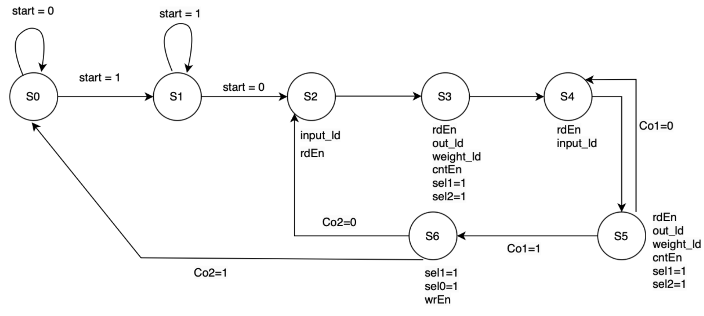

# Dense Unit for CNN in Chisel

This project implements a dense (fully connected) layer in Chisel, designed for matrix multiplication operations commonly used in Convolutional Neural Networks (CNNs). The dense layer performs the matrix-vector multiplications critical in the forward pass of a neural network, following convolutional and pooling layers.

The dense unit is structured to take in matrix inputs and perform efficient dot-product calculations, leveraging hardware-level parallelism to accelerate processing. Designed in [Chisel](https://www.chisel-lang.org/), a high-level hardware description language, this unit is adaptable to various CNN models and suitable for integration into larger hardware-based neural networks.

### Controller

